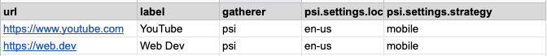
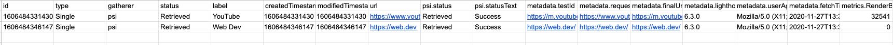
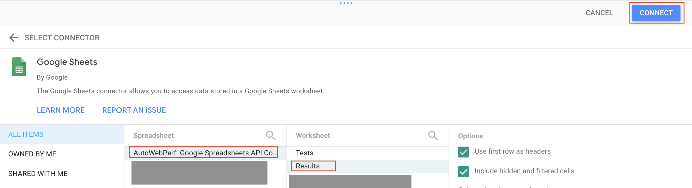

# Google Spreadsheets API Connector

## Overview
The Google Spreadsheet API Connector allows to import Tests list as well as Export their Results to Google Spreadsheet files via the [Google Sheets API](https://developers.google.com/sheets/api).

## Required Environmental Variables

- `SERVICE_ACCOUNT_CREDENTIALS` - The path to the Service Account json file.

## How to use

In order to use the [Google Sheets API](https://developers.google.com/sheets/api) via npm you need to complete these steps:


1. Create a new or use an existing [Google Service Account](https://cloud.google.com/iam/docs/creating-managing-service-accounts).

2. Create a new or existing Google Sheets file and share it with the Google Service Account email address with Editor permissions (Example template available [here](https://docs.google.com/spreadsheets/d/1c3k9eEVg12Atoa72tglVVBg--o0CEMkOF3JCaLlxzeo/))
    1. This file should have Tab names useful to either fetch the Tests list, print the Results or both.
    In this example the file contains a `Tests` Sheet to fetch tests list (image below) and another Tab named `Results` where to print the results.



    2. Identify the Google Sheet ID (visibile in theURL between `/d/` and before `/edit`).
Example for this URL `https://docs.google.com/spreadsheets/d/1c3k9eEVg12Atoa72tglVVBg--o0CEMkOF3JCaLlxzeo/edit` the Google Sheet ID would be `1c3k9eEVg12Atoa72tglVVBg--o0CEMkOF3JCaLlxzeo`.

3. Download the service-account.json credentials from the [Service accounts page](https://console.cloud.google.com/iam-admin/serviceaccounts) and store them safely. In this example the file is stored inside a "tmp" folder.

4. Run the command selecting the appropriate tests and results connector. In this example 2 URLs are being tested via PSI API defined into a Google Sheet file Tab `Tests` and the results will be printed into the `Results` Tab.


```
SERVICE_ACCOUNT_CREDENTIALS=./tmp/service-account.json CRUX_APIKEY=MY_API_KEY ./awp run sheets:[MY GOOGLE SHEET ID]/Tests sheets:[MY GOOGLE SHEET ID]/Results
```

5. The expected outcome once the tests are completed looks as the following below:



6. In order to create your AWP CrUX API Dashboard you can use this [DataStudio template](https://datastudio.google.com/reporting/5f7b6c8c-cae2-4cf2-97a4-06af250a0039/page/X6nFB/preview) and follow the instructions below:  
    1. Click on the "Use Template" button on the top left of the [DataStudio template](https://datastudio.google.com/reporting/5f7b6c8c-cae2-4cf2-97a4-06af250a0039/page/X6nFB/preview).
    2. Click on the "New Data Source" Dropdown and select "Create New Data Source".
    3. Select the "Google Shets" Google Connector.
    4. Look for your Google Sheets file, select the "Results" Tab and click on "Connect".
.
    5. Now you should see all the sheets fields being populated and you can continue by clicking on the "Add to Report" button.
    6. Lastly click on the "Copy Report" button to create your own AWP CrUX API Dashboard getting results from the selected Data Source, your Google Sheet file. 
